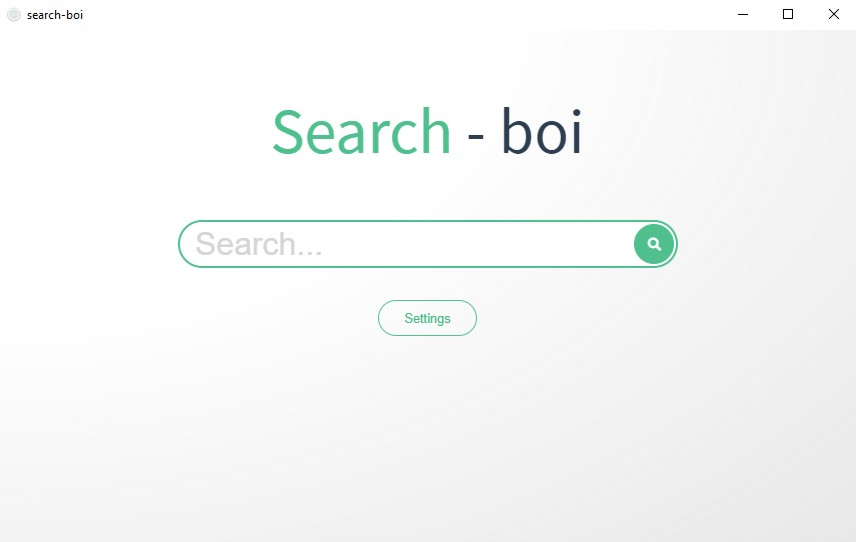
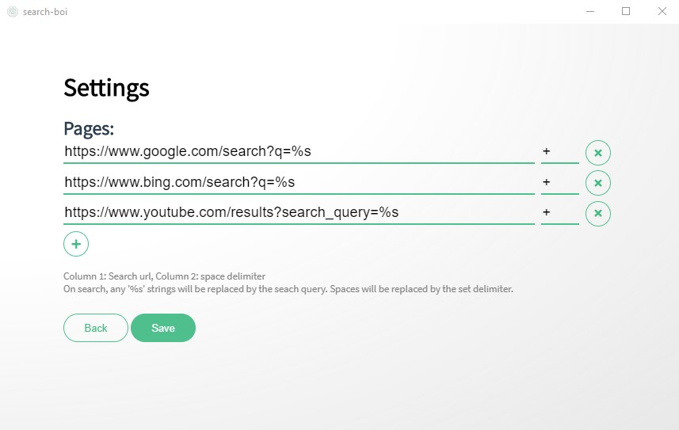

# search-boi 🌍🔍 

Search boi is a simple desktop utility for searching multiple web pages at once. It allows you to define the desired web pages which are opened in your default web browser with the provided search query.
The pages are defined as a url, where the string `%s` is replaced by your query. You can also set the delimiter which substitutes spaces in your search query (usually `+`, `-` or `%20`). The settings are stored locally.




#### Build Setup

``` bash
# install dependencies
npm install

# serve with hot reload at localhost:9080
npm run dev

# build electron application for production
npm run build


# lint all JS/Vue component files in `src/`
npm run lint

```


---

> An electron-vue project
Documentation about the original boilerplate can be found [here](https://simulatedgreg.gitbooks.io/electron-vue/content/index.html).
